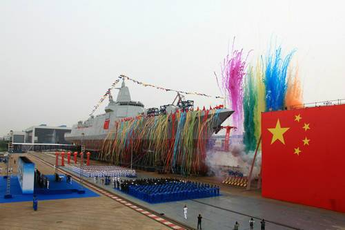

### 基础标签
* html: hyperText markup language  
* 超文本标记语言  
html语言由一对一对的标签组成，每一对标签都有一个对应的特殊的功能，许多标签拼一起形成语言  
标签：头标签 与 尾标签 组成
头标签：左尖括号 + 标签名称 + 右尖括号  
尾标签：左尖括号 + 结束符`/` + 标签名称 + 右尖括号  
根标签`<html></html>`，一个html文件只能有一个跟标签，只能在根标签里面编程  
根标签里面分为两个结构化标签：  `<head></head>` `<body></body>`
常用编码字符集：gb2312, gbk, unicode, uft-8  
`<html lang="en">` 告诉搜索引擎爬虫我们的网站是关于什么内容的，en表示英文内容，zh表示中文内容；SEO技术；  
`<p>段落</p>` 让内容成段展示  
`<h1></h1>` h1~h6 标题标签，成段展示，更改字体大小，加粗字体  
`<strong>加粗</strong>`  
`<em>斜体</em>`  
`<del>中划线</del>`  
`<address>地址</address>` 成段斜体  
`<div>独占一行</div>` 1、充当容器：结构化；2、绑定操作；  
空格：英文单词分隔符，不代表空格文本，所以多个空格也只分割一次；回车也是；  
html编码   
`&nbsp;`空格 
`&lt;` 左尖括号 less than  
`&gt;` 右尖括号 great than  
`<br>` 换行  
`<hr>` 水平线
`<span>没有效果</span>` 1、充当容器：结构化；2、绑定操作  
`ol li`有序列表，type排序方式，5种，1/a/A/i/I；reversed逆转；start从第几位开始  
`ul li`无序列表，type="disc"实心圆，square方形，circle圈  
`` src：1、网上的url；2、本地的相对路径、绝对路径；alt：容错信息，图片占位符；title：图片提示符；  
`<a href="地址">文本</a>` 超文本引用，超链接；锚点；  
`<a href="tel:1212312"></a>`打电话  
`<a href="mailto:dasd@www.com"></a>`发邮件  
`<a href="javascript:">可以写javascript代码</a>`协议限定符，可以强制运行里面的代码  
`<form method="" action=""></form>`表单，从前端往后端发送数据；method方法；action接收方地址  
`<input type="" name="" value="">`type：类型；name数据的名；value数据的值  
  
* 主流浏览器  
  >IE              trident  
  >Firefox         Gecko  
  >Google chrome   Webkit/blink  
  >Safari          Webkit  
  >Opera           presto  

 ### CSS
 cascading style sheet  层叠样式表
 * 1、引入css
> 行间样式  
``` html
    <div style="
        width: 100px;
        height: 100px;
        background-color: red;
    "></div>
```
> 页面级css
``` html
    <style type="text/css">
        div{
            width: 100px;
            height: 100px;
            background-color: red;
        }
    </style>
```
> 外部css文件
``` html
    <link rel="stylesheet" type="text/css" href="main.css">
    <!-- css 文件 -->
    <!-- main.css
    div{
        width: 100px;
        height: 100px;
        background-color: red;
    }
    -->
```
> link html 下载一行执行一行  
> link css 开启新线程下载，异步同时下载
* 选择器
> id选择器
``` html
    <div id="onlyname1"></div>
    <div id="onlyname2"></div>
    <!-- css:
        #onlyname1{
            background-col0r: red;
        }
        #onlyname2{
            backround-color: green;
        }
    -->
```
> class选择器
``` html
    <div class="demo demo1">123</div>
    <!-- css:
        .demo{
            background-color: yellow
        }
        .demo1{
            width: 100px
        }
    -->
```
> 标签选择器
``` html
    <div>456</div>
    <!-- css:
        div {
            background-color: red;
        }
    -->
```
> 通配符选择器
``` html
    <span>123</span>
    <div>234</div>
    <strong>111</strong>
    <!-- css:
        * {
            background-color: green;
        }
    -->
```
> 属性选择器
``` html
    <div id="only" class="demo"></div>
    <!-- css []里写属性值 id、class等标签属性
        []/[id]/[class]/[id="only"]
        {
            background-color: red;
        }      
    -->
```
> `!impottant` 加载在特定属性上
``` html
    <div style="background-color: red;"></div>
    <!-- css []里写属性值 id、class等标签属性
        div {
            background-color: red!important;
        }      
    -->
```
> 选择器优先级 权重, 256进制  
!impottant              Infinity    正无穷
行间样式                 1000
id                      100
class、属性、伪类        10
标签、伪元素             1
通配符 `*`               0
``` html
    <div id="only" class="demo">123</div>
    <!-- css:
        #only {
            backrground-color: red;
        }
        .demo {
            background-color: green;
        }
        div {
            background-color: yellow;
        }
    -->
```
> 父子选择器/派生选择器  
> 只要表示父子关系就可以，不一定是标签，可以是类，id
``` html
    <!-- 
    -->
    <div>
        <span>123</span>
    </div>
    <span>234</span>
    <!-- 
    span {  // 会选中所有的span

    }
    div span {  // 只选择div里面的span
        
    } -->

    <div class="wrapper">
        <strong class="box">
            <em>234</em>
        </strong>
    </div>
    <!--
    strong em {

    }  
    .wrapper .box em {
        background-color: red;
    } -->

    <div>
        <em>1</em>
        <strong><em>2</em></strong>
    </div>
    <!--     
    div em {
        background-color: red;
    } -->

```
> 直接子元素选择器
``` css
    div > em {
        background-color: red;
    }
```
> 浏览器排查父子选择器方式：从右向左排查（从子往父排查），避免从父级开始挨个遍历
``` html
    <section>
        <div>
            <p>
                <a href="">
                    <span></span>
                </a>
            </p>
            <ul>
                <li>
                    <a href="">
                        <span>
                            <em>1</em>
                        </span>
                    </a>
                </li>
            </ul>
        </div>

        <a href="">
            <p>
                <em>2</em>
            </p>
            <div></div>
        </a>
    </section>
```
``` css
<!-- 查找顺序
    1、查找到所有em
    2、顺序往根上找
-->
section div ul li a em {
    background-color: red;
}
```
> 并列选择器
> 多个选择条件，中间不加空格
``` html
    <div>1</div>
    <div class="demo">2</div>
    <p class="demo">3</p>
```
``` css
    <!-- 选择中间的div -->
    div.demo {
        background-color: red;
    }
```
> 权重：复杂选择器权重的计算  
``` html
    <div class="classDiv" id="idDiv">
        <p class="classP" id="idP">1</p>
    </div>
```
``` css
<!-- 写在同一排的选择器，权重值相加，比较大小；大小相同，后面覆盖前面；!important 正无穷大，在css里是有限值，Infinity+1 > Infinity -->
/* 100 + 1 */
#idDiv p {
    background-color: red;
}
/* 100 + 1 + 10 */
#idDiv p.classP {
    background-color: red;
}
/* 10 + 10 */
.classDiv .classP{
    background-color: green;
}
/* 1 + 10 + 100 */
div .classP#idP{    
    background-color: yellow;
}
```
> 分组选择器
``` html
    <em>1</em>
    <strong>2</strong>
    <span>3</span>
```
``` css
em strong span{
    background-color: red;
}
```
``` html
    <div class="demo1"></div>
    <div class="demo2"></div>
```
``` css
.demo1 {
    /* width: 100px; */
    /* height: 100px; */
    background-color: red;
}
.demo2 {
    /* width: 100px; */
    /* height: 100px; */
    background-color: green;
}
.demo1,
.demo2 {
    width: 100px;
    height: 100px;
}
```
### CSS 属性
> font
``` html
    <div>举个例子</div>
```
``` css
    div {
        /* 设置的是字体的高 */
        font-size: 14px;
        /* 字体能否加粗，取决于字体包里的样式设置 */
        font-weight: bold;
        /* italic斜体 */
        font-style: italic;
        /* arial 最常用字体，乔布斯发明 */
        font-family: arial;
        /* 边框：粗细 形式 颜色 */
        /* 四个边的框，每个边可以单独设置 */
        border: 1px solid black;
        border-width: 20px;
        border-style: dotted;
        border-color: black;
    }
```
* 缩进单位：em  
相对单位：1em = 1 font-size
文字的行高=1.2 * font-size  

* 标签分类：   
1、行级（内联）元素：内容决定元素所占位置，不可以通过css改变宽高  
span,a,strong,em,b,i,del  
css：隐式包含：display:inline;
2、块级元素：独占一行，可以通过css改变宽高  
div,p,ol,ul,li,form,address  
css：隐式包含：display:block;
3、行级块元素：内容决定大小，可以该宽高   
img
css：隐式包含：display: inline-block;
> 可以通过css改变属性  
> 凡是带有inline的元素都有文字特性，就会被分割，4px
``` html



<!-- 去掉分割的4px间隔：去掉空格 -->

```
* 模块化开发，先定义css功能，后选用功能
``` html
    <div class="red size1"></div>
    <div class="green size2"></div>
    <div class="gray size1"></div>
    <div class="gray size3"></div>
```
```css
.red {
    background-color: red;
}
.green {
    background-color: green;
}
.gray {
    background-color: gray;
}
.size1 {
    width: 100px;
    height: 100px;
}
.size2 {
    width: 200px;
    height: 200px;
}
.size3 {
    width: 300px;
    height: 300px;
}
```
* 标签选择器，初始化标签，自定义标签
```css
/* a标签去掉下划线，颜色黑色 */
a {
    text-decoration: none;
    color: #424242;
}
/* em标签去掉斜体，颜色红色 */
em {
    font-style: normal;
    color: #c00;
}
/* ul标签去掉黑点，缩进 */
ul {
    list-style: none;
    padding: 0;
    margin: 0;
}
```
* 通配符选择器：初始化所有标签，没有后遗症；权重是0，重新设置不会冲突，范围广
```html
    <p>123</p>
    <h1>234</h1>
```
```css
* {
    margin: 0;
    padding: 0;
    list-style: none;
    font-style: normal;
    text-decoration: none;
}
```

### 盒子模型
* 盒子三大部分：  
盒子壁：border  
内边距：padding  
内容区：width + height  
* 盒子模型：外边距 + 盒子  
外边距：margin  
``` css
/* <div></div> */
div {
    width: 100px;
    height: 100px;
    background-color: red;
    border: 10px solid black;
    padding: 100px;
    margin: 100px;
}
```
* padding
padding: 50px 100px 150px 200px;  
顺序：    上    右    下    左  
padding: 50px 100px 150px;  ==> padding: 50px 100px 150px 200px;  
顺序：    上   右左   下  
padding: 50px 100px; ==> padding: 50px 100px 50px 100px;
顺序：    上下  左右
* 盒子的计算
``` html
<!-- real width:  160 -->
<!-- real height: 160 -->
<div></div>
```
``` css
div {
    width: 100px;
    height: 100px;
    background-color: red;
    border: 10px solid black;
    padding: 10px 20px 30px;
    /* margin是外边距，不可见部分，不属于盒子，不纳入计算 */
    margin: 10px 20px;  
}
```
``` html
<!-- real width:  302px -->
<!-- real height: 102px -->
    <div id="my-defined"></div>
```
``` css
body {
    margin: 0;
}
#my-defined {
    width: 100px;
    height: 100px;
    padding: 0 100;
    margin: 110px 20px 30px 40px;
    border: 1px solid oragin;
    background-color: black;
}
```
```html
    <div class="wrapper">
        <div class="box">
            <div class="content">
                <div class="content1"></div>
            </div>
        </div>
    </div>
```
```css
.content1 {
    width: 10px;
    height: 10px;
    background-color: #0f0;
}
.content {
    width: 10px;
    height: 10px;
    padding: 10px;
    background-color: #000;
}
.box {
    width: 30px;
    height: 30px;
    background-color: #0f0;
    padding: 10px;
}
.wrapper {
    width: 50px;
    height: 50px;
    background-color: black;
    padding: 10px;
}
```
> body: 有天生的margin，8px

* 定位：position
> absolut  
1、脱离原来位置进行定位  
2、相对于最近的有定位的父级进行定位，如果没有，那么相对文档定位
``` html
    <!-- absolute -->
    <div></div>
```
``` css
div {
    position: absolute;
    left: 100px;    /* 左边线 */
    top: 100px;     /* 上边线 */
    width: 100px;
    height: 100px;
    background-color: red;
}
```
> relative  
1、保留原来位置定位  
2、相对于自己原来的位置定位
```html
    <div class="demo"></div>
    <div class="box"></div>
```
```css
* {
    margin: 0;
    padding: 0;
}
.demo {
    position: relative;
    left: 100px;
    top: 100px;
    width: 100px;
    height: 100px;
    background-color: red;
    opacity: 0.5;
}
.box {
    width: 150px;
    height: 150px;
    background-color: green;
}
```
```html
    <div class="wrapper">
        <div class="content">
            <div class="box"></div>
        </div>
    </div>
```
``` css
.wrapper {
    margin-left: 100px;
    width: 200px;
    height: 200px;
    background-color: orange;
}
.content {
    margin-left: 100px;
    width: 100px;
    height: 100px;
    background-color: black;
}
.box {
    position: absolute;
    left: 50px;
    width: 50px;
    height: 50px;
    background-color: yellow;
}
```
> fixed: 绝对定位
``` html

```
``` css
/* 居中、固定位置 */
div {
    position: fixed;
    left: 50%;
    top: 50%;
    width: 200px;
    height: 160px;
    margin-left: -100px;
    margin-top: -80px;
    background-color: red;
}
```
> 总结：用relative当支架，参考定位，absolute当技术，选区相对位置更灵活  
练习：五环
``` html
    <div class="plat">
        <div class="circle1"></div>
        <div class="circle2"></div>
        <div class="circle3"></div>
        <div class="circle4"></div>
        <div class="circle5"></div>
    </div>
```
``` css
* {
    margin: 0;
    padding: 0;
}

.plat {
    position: relative;
    left: 50%;
    top: 50%;
    width:380px;
    height: 180px;
    margin-left: -190px;
    margin-top: -90px;
    border: 5px solid black;
}

.circle1, 
.circle2,
.circle3,
.circle4,
.circle5 {
    position: absolute;
    width: 100px;
    height: 100px;
    border: 10px solid black;
    border-radius: 50%;
}

.circle1 {
    border-color: blue;
    left: 0;
    top: 0;
}

.circle2 {
    border-color: black;
    left: 130px;
    top: 0;
}

.circle3 {
    border-color: red;
    left: 260px;
    top: 0;
}

.circle4 {
    border-color: yellow;
    left: 65px;
    top: 60px;
}

.circle5 {
    border-color: green;
    left: 195px;
    top: 60px;
}
```
> 两栏布局
``` html
    <div class="right"></div>
    <div class="left"></div>
```
``` css
.right {
    position: absolute;
    right: 0;
    width: 100px;
    height: 100px;
    background-color: red;
    opacity: 0.5;
}

.left {
    margin-right: 100px;
    height: 100px;
    background-color: black;
}
```
> margin塌陷：父子嵌套的结构，margin垂直方向取最大的值
``` html
    <div class="wrapper">
        <div class="content"></div>
    </div>
```
``` css
.wrapper {
    margin-left: 100px;
    margin-top: 100px;
    width: 100px;
    height: 100px;
    background-color: black;
    /* 解决方案1、给父级加顶(最小1，不能是0，0没效果)，不专业 */
    border-top: 1px solid black;
}

.content {
    margin-left: 50px;
    /* 试试50px，100px，150px的值 */
    margin-top: 50px;
    width: 50px;
    height: 50px;
    background-color: green;
}
```
> bfc: block format context，块级格式化上下文  
> margin塌陷 不能完美解决  
css把每个标签当成1个盒子，每个盒子有一套渲染规则  
bfc设置后，可以改变盒子的语法规则，特定的盒子可以有一套特定的语法规则  
bfc触发方法：  
1、postion: absolute,  
2、display: inline-block,  
3、float: left/right  
4、overflow: hidden，溢出元素的部分要隐藏  
```css
.wrapper {
    margin-left: 100px;
    margin-top: 100px;
    width: 100px;
    height: 100px;
    background-color: black;
    
}
.content {
    margin-left: 50px;
    margin-top: 50px;
    width: 50px;
    height: 50px;
    background-color: green;
}
/* overflow: hidden方案： */
.wrapper {
    /* 改变大盒子的渲染规则 */
    /* overflow: hidden; */
    /* display: inline-block; */
    /* position: absolute; */
    /* float: left; */
    /* float: right; */     /* float: right; 整体跑到右边 */
}
.content {
    /* overflow: hidden;有部分会从右边溢出，会被隐藏 */
    /* display: inline-block;position: absolute;不会隐藏 */
    /* float: left; */
    
    margin-left: 75px;
    /* 正常位置，问题解决 */
    margin-top: 75px;
}
```
> margin塌陷例子：
margin 合并
``` html
    <!-- 塌陷效果 -->
    <div class="demo1">1</div>
    <div class="demo2">2</div>
    <!-- 改进：增加父级，包裹起来
    但是改变了结构，避免开发中使用
    这个例子要达到上下分开200px的效果，只要demo1的margin-bottom：200px就可以，用数学方法解决
    -->
```
``` css
<!-- 塌陷效果 -->
.demo1 {
    background-color: red;
    margin-bottom: 100px;
}
.demo2 {
    background-color: green;
    margin-top: 100px;
}
```

* float 浮动模型
> 能改变元素站队，站队的边界就是父级的边界
``` html
    <div class="wrapper">
        <div class="content">1</div>
        <div class="content">2</div>
        <div class="content">3</div>
    </div>
```
``` css
.wrapper {
    width: 300px;
    height: 300px;
    border: 1px solid black;
}
.content {
    color: fff;
    width: 100px;
    height: 100px;
    background-color: black;
    float: right;
    /* float: left; */
}
```
> 1、浮动元素产生了浮动流  
所有产生了浮动的元素，块级元素看不到他  
产生了bfc的元素和文本类属性的元素以及文本都能看到浮动元素  
``` html
    <div class="box"></div>
    <!-- <div class="demo"></div> -->
    <!-- 123 -->
    <!--  -->
    <!-- display: block -->
```
``` css
.box {
    float: left;
    width: 100px;
    height: 100px;
    background-color: black;
    opacity: 0.5;
}
.demo {
    width: 150px;
    height: 150px;
    background-color: green;
}
```
> 解决margin塌陷终极方法：清除浮动流
``` html
    <div class="wrapper">
        <div class="content">1</div>
        <div class="content">2</div>
        <div class="content">3</div>
        <!-- 方案1：添加结构，改变了结构，不好 -->
        <!-- <p class="clear"></p> -->
    </div>
```
``` css
.wrapper {
    border: 1px solid black;
}
.content {
    float: left;
    color: fff;
    background-color: black;
    width: 100px;
    height: 100px;
}
p {
    border-top: 0 solid green;
    /* 清除浮动 必须是块级元素才生效*/
    clear: both;
}
/* 方案2：使用伪元素 */
.wrapper::after {
    content: "";
    clear: both;
    display: block;
}
/* 方案3：
position: absolute;
float: left / right;
内部会把元素转换成inline-block，行级快元素，内容区大小随内容变化
 */
.wrapper{
    position: absolute;
    /* 或者 */
    float: left;
}
```
``` html 
<!-- inline-block，行级快元素例子 -->
<span>123</span>
```
``` css
span {
    /* 比较添加float前后的区别 */
    float: left;
    width: 100px;
    height: 100px;
    background-color: red;
}
```

* 伪元素 天生存在于每个标签里面  
元素结构是存在的，又不存在与html里面  
可以被css操作，没有html结构，通过css选择器显示出来  
content只能在伪元素中使用    
``` html
<span>很帅</span>
<!-- 实际显示 -->
<span>
    ::before
    很帅
    ::after
</span>
```
``` css 
/* 形式： */
/* 把标签里最前面的元素选出来 */
span::before{
content: "成哥   ";
/* 可以定位 */
position: relative;
left: 100px;
top: 100px;
/* 伪元素天生是行级元素，可以行级块级设置，等等 */
display: inline-block;
width: 100px;
height: 100px;
background-color: red;
}
/* 把标签最后面的元素选出来 */
span::after{
content: "  是的";
}
```

* 仿淘宝导航栏
``` html

    <!-- 写淘宝导航栏 -->
    <!-- 
    1、选择结构：
    2、去掉原始标签样式
    3、定义class，多个单词中划线连接
    4、去掉空余位置
    5、横过来，垂直排列改成水平排列
    6、内容边距
    7、容器高度，文字垂直居中
    8、可以点击a标签
    9、可视化边框参考线
    10、去掉下划线
    11、字体颜色，通用标准黑色：#424242
    12、字体，标准字体：arial
    13、鼠标移入颜色反转
    14、a标签与父级保持相同高度
    15、圆角，两边多余空间
    16、消除浮动流：content，display，clear 
    -->

    <ul class="nav">
        <li class="list-item">
            <a href="">天猫</a>
        </li>
        <li class="list-item">
            <a href="">聚划算</a>
        </li>
        <li class="list-item">
            <a href="">天猫超市</a>
        </li>
    </ul>
```
``` css
* {
    margin: 0;
    padding: 0;
    color: #424242;
    font-family: arial;
}

a {
    text-decoration: none;
}

.nav {
    list-style: none;
}

.nav::after {
    content: "";
    display: block;
    clear: both;
}

.nav .list-item {
    float: left;
    margin: 0 10px;
    height: 30px;
    line-height: 30px;
    border: 1px solid black;
}

.nav .list-item a {
    padding: 0 10px;
    display: inline-block;
    color: #f40;
    font-weight: bold;
    height: 30px;
    border-radius: 15px;
}

.nav .list-item a:hover {
    background-color: #f40;
    color: white;
}
```

### 文字溢出，背景图片处理，企业开发经验
* 1、单行文本
``` css
p {
  white-space: nowrap;
  overflow: hidden;
  text-overflow: ellipsis;
}
```
* 2、多行文本
计算字符宽度，手动修改增加`...`，阶段

* 3、背景图片
``` css
div {
  /* 容器尺寸 */
  width: 200px;
  height: 200px;
  border: 1px solid black;
  background-image: url(img/055.jpg);
  /* 背景内容尺寸 */
  background-size: 100px 100px;
  /* 背景图片不重复 */
  background-repeat: no-repeat;
  /* 居中 */
  background-position: 100px 100px;
  background-position: center center;
  background-position: 50% 50%;
}
```
* 4、当js与css未正常加载时，显示默认文字
``` html
<a href="#" target="_blank">淘宝网</a>
```
``` css
a {
  /* 去掉a标签默认样式 */
  display: inline-block;
  text-decoration: none;
  color: #424242;
  /* 基本样式 */
  width: 143px;
  height: 49px;
  background-image: url(img/taobao.png);
  background-size: 143px 49px;
  border: 1px solid black;

  /* 方案1 :设置缩进，把文字内容挤出图片区域*/
  text-indent: 143;
  overflow: hidden;
  white-space: nowrap;

  方案2：用padding撑开区域（背景图片或者颜色会覆盖padding）
  height: 0;
  padding-top: 49px;
  overflow: hidden;
  white-space: nowrap;
}
```
> 元素嵌套规则：
行级元素只能嵌套行级元素，块级元素可以嵌套行级元素和块级元素，p标签特殊：不能嵌套div
a标签不能嵌套a标签